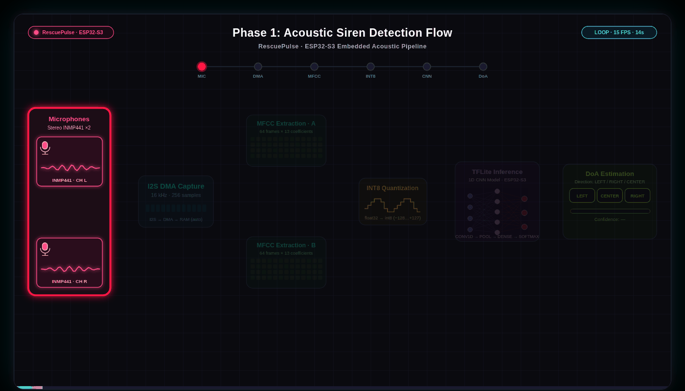
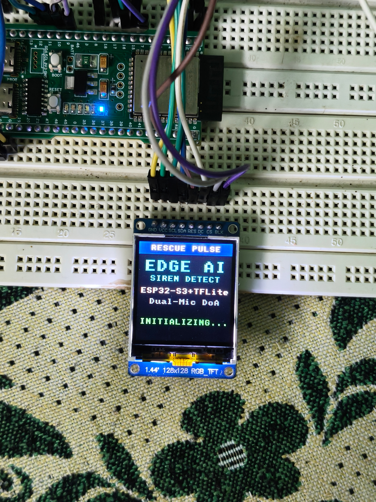
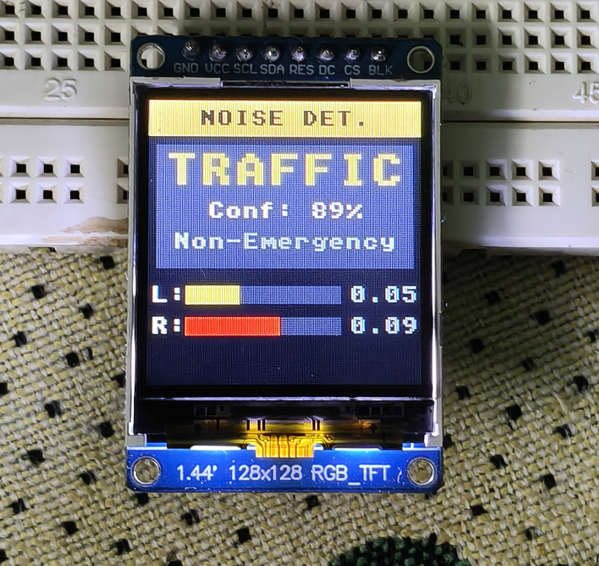
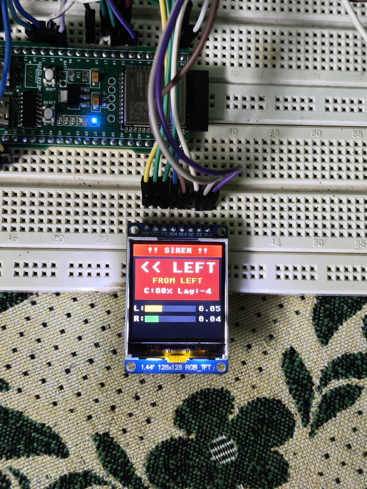
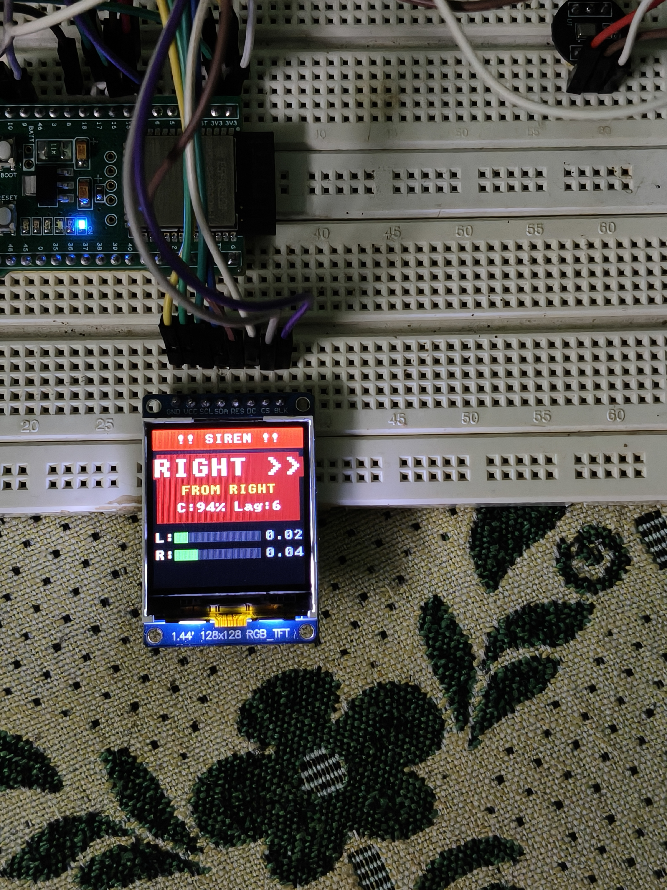
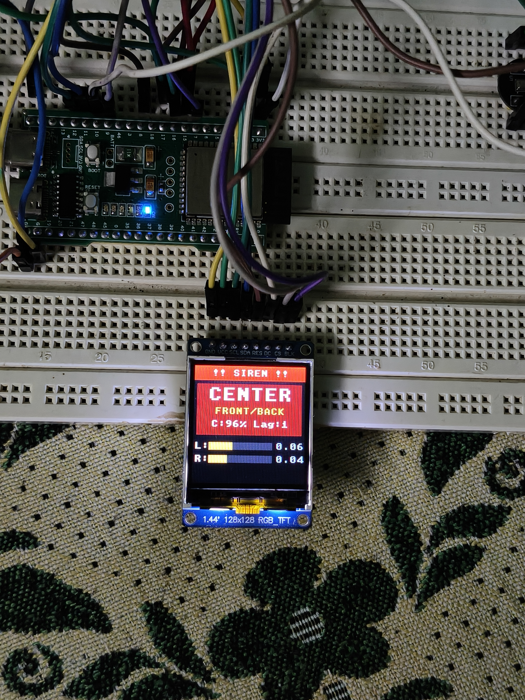
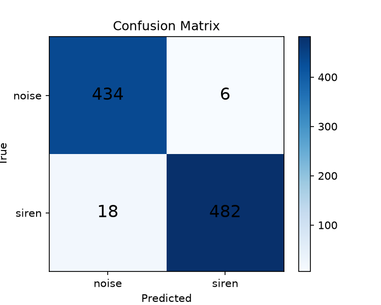
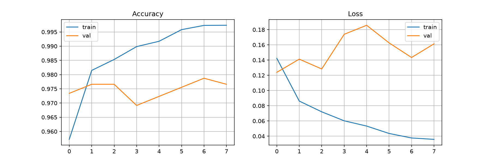

<div align="center">


# RescuePulse: Edge AI Emergency Siren Detection with Direction of Arrival (DoA)

### Real-Time Acoustic AI • Edge Computing • Smart Traffic Routing

</div>

---

RescuePulse is a high-performance, real-time edge computing system deployed on the ESP32-S3 microcontroller. It utilizes an on-device quantized Deep Neural Network (DNN) and a dual-microphone MEMS array to accurately detect emergency vehicle sirens (ambulances, fire engines, police) and determine their directional origin (LEFT, RIGHT, or CENTER) before the vehicle is visually in range.

The entire audio preprocessing, feature extraction, Time Difference of Arrival (TDOA) correlation, and neural network inference execute locally on-chip in real time with zero cloud dependency and sub-15 ms latency per evaluation frame.

---


## System Pipeline Visualization

<div align="center">
  
  <br>
  <em>Complete system execution flow from audio capture through acoustic detection to traffic control</em>
</div>


---

## Key Capabilities and Performance Metrics

- **Real-Time Acoustic Classification:** Identifies emergency sirens against heavy urban noise (traffic, engines, horns, construction, speech).
- **Direction of Arrival (DoA) Estimation:** Uses dual-channel I2S capture and ESP-DSP cross-correlation (`dsps_corr_f32`) to localize siren source direction (Left / Right / Center) based on inter-microphone arrival time delay.
- **Strict Mathematical Parity:** C-based MFCC feature extraction achieves <1% L2 relative error compared to 64-bit Python Librosa references.
- **Full INT8 Quantization:** 108 KB quantized TensorFlow Lite for Microcontrollers model running without accuracy loss compared to the FP32 baseline.
- **Dual-Core FreeRTOS Pipeline:** Core 0 is dedicated to lossless stereo I2S DMA capture; Core 1 executes feature extraction, TDOA correlation, and TFLite inference.
- **Deterministic Memory Architecture:** Zero dynamic allocations (`malloc`) inside FreeRTOS task execution loops; uses static ping-pong buffers and Flash-mapped model data.
- **Noise and Silence Gating:** Dynamic AC RMS thresholding prevents false triggers during quiet or ambient background intervals.
- **Debounced Majority Voting:** 5-window rolling majority vote with high confidence gating (>= 75%) eliminates transient false positives.

---

## System Architecture

```
                                  ESP32-S3 System Pipeline
  ┌────────────────────────────────────────────────────────────────────────────────────────┐
  │                                                                                        │
  │  Mic 1 (Left)   ──┐                                                                    │
  │  (L/R -> GND)     │  I2S DMA (Core 0)      Ping-Pong Buffer       MFCC Extraction      │
  │                   ├────────────────────► [2][2][16640] Int16 ──► (512-pt FFT, 40 Mel,  │
  │  Mic 2 (Right)  ──┘  16 kHz Stereo         (133 KB static)        13 DCT Coeffs)       │
  │  (L/R -> 3.3V)                                                          │              │
  │                                                                         ▼              │
  │                      TDOA Cross-Correlation                      INT8 Quantization     │
  │                      dsps_corr_f32 (ESP-DSP)                            │              │
  │                                 │                                       ▼              │
  │                                 ▼                               TFLite Micro Model     │
  │                        Direction of Arrival                      (1D CNN Classifier)   │
  │                        [LEFT/RIGHT/CENTER]                              │              │
  │                                 │                                       ▼              │
  │                                 └───────────────┬───────────────────────┘              │
  │                                                 ▼                                      │
  │                                   5-Window Rolling Majority Vote                       │
  │                                                 │                                      │
  │                                                 ▼                                      │
  │                                   🚨 SIREN DETECTED [LEFT/RIGHT]                       │
  │                                                 │                                      │
  │                                                 ▼                                      │
  │                         🚦 PHASE 2: Emergency Vehicle Priority Control                 │
  │                            (Traffic Light State Machine)                               │
  │                                                                                        │
  │                          Lane GPIOs (1-6, 13-14, 21)                                   │
  │                          ┌─ LEFT:   RED(1) YELLOW(2) GREEN(3)                          │
  │                          ├─ CENTER: RED(4) YELLOW(5) GREEN(6)                          │
  │                          └─ RIGHT:  RED(13) YELLOW(14) GREEN(21)                       │
  │                                                                                        │
  │                          Dynamic Mode Selection:                                       │
  │                          • MODE_NORMAL:    Regular green→yellow→red cycling            │
  │                          • MODE_CLEARANCE: 2s all-red safety transition                │
  │                          • MODE_EMERGENCY: Priority green on siren lane                │
  │                                                                                        │
  └────────────────────────────────────────────────────────────────────────────────────────┘
```
---

## Live Hardware Execution Logs

Below is a serial capture from an ESP32-S3 running live dual-microphone inference in real time:

```text
I (1410146) rescuepulse: 🔇 Background Noise [0/5] (Conf: 0.91) [RMS L:0.028 R:0.031]
W (1415336) rescuepulse: 🚨 SIREN DETECTED [LEFT] (Conf: 0.99) [3/5] [RMS L:0.087 R:0.043, Lag: -4, MaxPCM: 9100]
W (1420546) rescuepulse: 🚨 SIREN DETECTED [LEFT] (Conf: 0.88) [4/5] [RMS L:0.082 R:0.047, Lag: -4, MaxPCM: 8092]
W (1425746) rescuepulse: 🚨 SIREN DETECTED [RIGHT] (Conf: 1.00) [5/5] [RMS L:0.091 R:0.165, Lag: 5, MaxPCM: 15097]
W (1430936) rescuepulse: 🚨 SIREN DETECTED [RIGHT] (Conf: 0.98) [5/5] [RMS L:0.066 R:0.090, Lag: 5, MaxPCM: 9646]
W (1436146) rescuepulse: 🚨 SIREN DETECTED [CENTER] (Conf: 0.97) [5/5] [RMS L:0.083 R:0.060, Lag: -1, MaxPCM: 11096]
W (1441346) rescuepulse: 🚨 SIREN DETECTED [CENTER] (Conf: 0.98) [5/5] [RMS L:0.094 R:0.064, Lag: -1, MaxPCM: 10679]
W (1446536) rescuepulse: 🚨 SIREN DETECTED [CENTER] (Conf: 0.84) [5/5] [RMS L:0.041 R:0.042, Lag: 0, MaxPCM: 6456]
I (1451746) rescuepulse: 🔇 Background Noise [1/5] (Conf: 0.93) [RMS L:0.037 R:0.040]
```

### System Visual Demonstrations

<div align="center">
  
  
</div>
*<small> Left: System boot screen showing startup status and initialization.  
  
Right: Traffic noise demonstration showing real-time siren detection and direction of arrival.</small>*
</div>

#### Direction of Arrival Visualization
<div align="center">
  
  
  
</div>
*<small>Real-time visualizations of siren detection from different microphone positions: Left, Right, and Center.</small>*

---

### Model Training Outcomes





---

## Hardware Configuration

### Bill of Materials

| Component | Specification | Function |
|---|---|---|
| **MCU** | ESP32-S3-WROOM-1-N16R8 (Edgehax N16R8 Pro) | Dual-core Xtensa LX7 @ 240 MHz, 16 MB Flash, 8 MB Octal PSRAM |
| **Microphone 1** | INMP441 I2S MEMS Microphone | Left acoustic sensor |
| **Microphone 2** | INMP441 I2S MEMS Microphone | Right acoustic sensor |
| **Power** | 3.3V Regulated Power Rail | Low-noise analog/digital supply |

### Hardware Wiring Maps

#### 1. Dual INMP441 Microphones (I2S Audio Bus)

| Signal | Mic 1 (Left Channel) | Mic 2 (Right Channel) | ESP32-S3 Pin | Function |
|---|---|---|---|---|
| **VDD** | 3.3V | 3.3V | 3.3V | Power supply |
| **GND** | GND | GND | GND | Common ground |
| **SCK / BCLK** | SCK | SCK | **GPIO 15** | Bit Clock (shared) |
| **WS / LRCLK** | WS | WS | **GPIO 16** | Word Select (shared) |
| **SD / DOUT** | SD | SD | **GPIO 17** | Serial Data (shared single DIN) |
| **L/R** | **Tied to GND** | **Tied to 3.3V** | — | Hardware slot selection |

#### 2. ST7735S SPI TFT Display (128x128 RGB)

| ST7735S Pin | ESP32-S3 GPIO | Function |
|---|---|---|
| **SCL / SCLK** | **GPIO 12** | SPI Clock |
| **SDA / MOSI** | **GPIO 11** | SPI Master Out / Data |
| **DC / RS** | **GPIO 10** | Data / Command Select |
| **CS** | **GPIO 9** | Chip Select (or GND if none) |
| **RST / RES** | **GPIO 8** | Hardware Reset |
| **BLK / LED** | **GPIO 7** | Backlight (3.3V) |
| **VCC** | **3.3V** | Power supply |
| **GND** | **GND** | Ground |

*How shared SD works:* During standard Philips I2S transmission, Mic 1 drives the data bus during the Left slot (WS LOW) and tri-states its output driver during the Right slot (WS HIGH), while Mic 2 drives during the Right slot and tri-states during the Left slot.

---

## Signal Processing & Direction of Arrival (DoA)

### 1. Dual-Channel Capture & De-interleaving
The I2S peripheral captures 32-bit interleaved stereo slots at 16,000 Hz. The capture driver unpacks the DMA scratch buffer:
- Left Channel (Mic 1): Even slot index, arithmetic right-shifted `>> 16`.
- Right Channel (Mic 2): Odd slot index, arithmetic right-shifted `>> 16`.

### 2. Time Difference of Arrival (TDOA)
Sound propagation delay $\Delta t$ between the two microphones separated by distance $d$ is estimated by computing normalized cross-correlation:

$$R_{LR}(\tau) = \sum_{n} x_L[n + \tau] \cdot x_R[n]$$

Using the hardware-accelerated `dsps_corr_f32` routine from ESP-DSP:
- **$\tau < -\text{threshold}$:** Left microphone received the wavefront first $\rightarrow$ **Source on LEFT**.
- **$\tau > +\text{threshold}$:** Right microphone received the wavefront first $\rightarrow$ **Source on RIGHT**.
- **$|\tau| \le \text{threshold}$:** Frontal / equidistant arrival $\rightarrow$ **Source in CENTER**.

Cross-correlation vectors are averaged across multiple windows to ensure stability in resonant environments.

### 3. Acoustic Feature Extraction (MFCC)
Inference is executed on the channel with higher RMS volume:
1. **Pre-emphasis:** $y[n] = x[n] - 0.97 \cdot x[n-1]$.
2. **Hamming Window & STFT:** 512-point real FFT with 256-sample hop size over 64 frames ($\sim 1.04\text{ s}$).
3. **Mel Filterbank:** 40 triangular filters spanning 20 Hz to 8000 Hz.
4. **Log Power Spectrum:** Logarithmic scaling with $-80\text{ dB}$ floor.
5. **Discrete Cosine Transform (DCT-II):** Orthogonal projection to 13 MFCC coefficients.

---

## Neural Network & Quantization

### Model Architecture (1D CNN)
```
Input: (64, 13) MFCC Spectrogram
  │
  ├──► Conv1D (64 filters, kernel=3, padding='same') + BatchNorm + ReLU + MaxPool(2)
  ├──► Conv1D (128 filters, kernel=3, padding='same') + BatchNorm + ReLU + MaxPool(2)
  ├──► Conv1D (128 filters, kernel=3, padding='same') + BatchNorm + ReLU + Dropout(0.3)
  ├──► GlobalAveragePooling1D
  ├──► Dense (64 units) + ReLU + Dropout(0.3)
  └──► Dense (2 units, Softmax) -> [Noise, Siren]
```

### Quantization & Memory Budget
- **Model Type:** TensorFlow Lite INT8 (Full Integer Post-Training Quantization).
- **Model Flash Size:** 108,392 bytes (placed in `.flash.rodata`).
- **RAM Footprint:**
  - `s_audio_buf` (Ping-Pong Stereo): 133,120 bytes.
  - TDOA / MFCC Static Buffers: ~18 KB.
  - Stack Allocations: 20 KB total across Core 0 and Core 1.
  - Total Internal DRAM Utilization: **76.4% (250 KB / 328 KB)**, leaving $>77\text{ KB}$ headroom.
  - TFLite Tensor Arena: 200 KB allocated in external Octal PSRAM (8 MB total).

---

## Repository Structure

```
RescuePulse/
├── Rescue_Pulse_PIO/            # PlatformIO ESP32-S3 Firmware Project
│   ├── src/
│   │   ├── main.c               # Core orchestration, TDOA DoA, RMS metering, voting
│   │   ├── i2s_capture.c/.h     # 16kHz 32-bit stereo I2S DMA driver
│   │   ├── mfcc.c/.h            # ESP-DSP accelerated MFCC extraction
│   │   ├── inference.cpp/.h     # TFLite Micro C++ bridge & tensor arena management
│   │   ├── model_data.cc        # Flash-mapped INT8 TFLite model binary
│   │   ├── model_config.h       # Standardization & affine quantization constants
│   │   ├── mel_tables.h         # Precomputed filterbank & DCT tables
│   │   └── test_vectors.h       # Pre-computed validation test vectors
│   ├── platformio.ini           # Build flags, board config, and dependencies
│   └── partitions_16MB.csv      # 16 MB flash partition configuration
│
├── datasets/                    # Audio datasets & metadata manifests
├── models/                      # Trained Keras models & quantization artifacts
├── scripts/                     # Python ML training & validation pipeline
│   ├── audit_dataset.py         # Audio dataset validation and deduplication
│   ├── process_raw_data.py      # Resampling and audio normalization
│   ├── extract_features.py      # Batch MFCC extraction with SpecAugment
│   ├── train_model.py           # Keras 1D CNN training with clip-level voting
│   ├── quantize_model.py        # Post-training int8 TFLite quantization
│   └── gen_mfcc_test_vectors.py # C header generation for mathematical parity tests
└── assets/                      # Schematics, logs, and documentation media
```

### Assets Gallery

The `assets/` directory contains comprehensive visual documentation of the RescuePulse system in action:

- **Boot Display**: System initialization and startup sequence
- **Direction of Arrival**: Real-time siren detection from Left, Right, and Center positions
- **Live System Output**: Traffic noise demonstration showing multi-source detection
- **Model Prediction Tests**: Classification visualizations and activation patterns

These images provide concrete visual evidence of the system's real-time edge AI capabilities and user-facing interface.

## Live Hardware Execution Logs

Below is a serial capture from an ESP32-S3 running live dual-microphone inference in real time:

```text
I (1410146) rescuepulse: 🔇 Background Noise [0/5] (Conf: 0.91) [RMS L:0.028 R:0.031]
W (1415336) rescuepulse: 🚨 SIREN DETECTED [LEFT] (Conf: 0.99) [3/5] [RMS L:0.087 R:0.043, Lag: -4, MaxPCM: 9100]
W (1420546) rescuepulse: 🚨 SIREN DETECTED [LEFT] (Conf: 0.88) [4/5] [RMS L:0.082 R:0.047, Lag: -4, MaxPCM: 8092]
W (1425746) rescuepulse: 🚨 SIREN DETECTED [RIGHT] (Conf: 1.00) [5/5] [RMS L:0.091 R:0.165, Lag: 5, MaxPCM: 15097]
W (1430936) rescuepulse: 🚨 SIREN DETECTED [RIGHT] (Conf: 0.98) [5/5] [RMS L:0.066 R:0.090, Lag: 5, MaxPCM: 9646]
W (1436146) rescuepulse: 🚨 SIREN DETECTED [CENTER] (Conf: 0.97) [5/5] [RMS L:0.083 R:0.060, Lag: -1, MaxPCM: 11096]
W (1441346) rescuepulse: 🚨 SIREN DETECTED [CENTER] (Conf: 0.98) [5/5] [RMS L:0.094 R:0.064, Lag: -1, MaxPCM: 10679]
W (1446536) rescuepulse: 🚨 SIREN DETECTED [CENTER] (Conf: 0.84) [5/5] [RMS L:0.041 R:0.042, Lag: 0, MaxPCM: 6456]
I (1451746) rescuepulse: 🔇 Background Noise [1/5] (Conf: 0.93) [RMS L:0.037 R:0.040]
```
---

## Phase 2: Emergency Vehicle Priority Traffic Light Control

### Overview

Phase 2 extends RescuePulse with intelligent traffic light management that responds dynamically to incoming emergency vehicles. When a siren is detected by the acoustic system, the traffic controller automatically manages lane states to provide safe priority passage for the emergency vehicle while maintaining intersection safety through proper clearance sequencing.

### Traffic Control Architecture

**Three Operating Modes:**

1. **MODE_NORMAL** — Standard traffic cycling
   - Lane sequence: LEFT → CENTER → RIGHT → LEFT (repeating)
   - Each lane cycles: GREEN (8s) → YELLOW (2s) → RED
   - All lanes cycle through automatically with no external input

2. **MODE_CLEARANCE** — Safety transition phase
   - All traffic lights set to RED for 2 seconds
   - Ensures intersection is cleared before emergency vehicle priority begins
   - Automatically activated when transitioning from NORMAL to EMERGENCY
   - Prevents collisions during mode switches

3. **MODE_EMERGENCY** — Emergency vehicle priority
   - Siren-detected lane receives continuous GREEN
   - All other lanes held at RED
   - Extends green indefinitely while siren continues
   - Automatically exits after 10 seconds without siren detection

### Detection Message Flow

The inference task (Core 1) continuously sends `detection_msg_t` messages via FreeRTOS queue:

```c
typedef struct {
    bool  siren_active;   /* true if siren detected */
    lane_t direction;     /* LANE_CENTER, LANE_LEFT, or LANE_RIGHT */
    float confidence;     /* Classification confidence (0.0 - 1.0) */
} detection_msg_t;
```

The traffic controller processes these messages to:
- Update emergency lane information
- Refresh the "last siren detected" timestamp
- Optimize state transitions to minimize clearance delays when the emergency vehicle is already on a GREEN lane

### GPIO Pin Mapping

Nine GPIO pins control the 3-lane traffic light array (RGB LEDs):

| Lane | Red | Yellow | Green |
|------|-----|--------|-------|
| **LEFT** | GPIO 1 | GPIO 2 | GPIO 3 |
| **CENTER** | GPIO 4 | GPIO 5 | GPIO 6 |
| **RIGHT** | GPIO 13 | GPIO 14 | GPIO 21 |

All pins are configured as digital outputs with no pull resistors. Drive strength is suitable for direct LED control with current-limiting resistors on the hardware side.

### State Machine Transitions

```
┌──────────────┐
│ MODE_NORMAL  │◄─────────────────────────────┐
│ (Cycling)    │                              │
└──────┬───────┘                              │
       │                                      │
       │ Siren detected on different lane     │ No siren for
       │ or during yellow phase               │ 10+ seconds
       │                                      │
       ▼                                      │
┌──────────────┐                              │
│MODE_CLEARANCE│                              │
│ (2s all RED) │                              │
└──────┬───────┘                              │
       │                                      │
       │ After 2 seconds                      │
       │                                      │
       ▼                                      │
┌──────────────────┐                          │
│ MODE_EMERGENCY   │──────────────────────────┘
│ (Siren lane      │
│  GREEN, all else │
│  RED)            │
└──────────────────┘
```

### Optimization Features

**Smart Clearance Avoidance:** If a siren is detected on a lane that is already GREEN in NORMAL mode and not in YELLOW phase, the controller directly transitions to EMERGENCY mode without the clearance delay, reducing emergency vehicle wait time.

**Message Queue Processing:** The traffic controller checks for detection messages every 100 ms, allowing responsive updates while maintaining predictable state transitions for non-emergency traffic.

**Timeout Safety:** Emergency mode automatically expires if 10 seconds pass without any siren detection, ensuring the system returns to normal operation even if detection messages stop unexpectedly.

### Integration with Phase 1 (Acoustic Detection)

The traffic control system is tightly integrated with the siren detection pipeline:

1. **inference_task** (Core 1) performs acoustic analysis and generates detection messages
2. Detection messages are sent via `g_traffic_queue` (FreeRTOS queue)
3. **traffic_ctrl_task** (also Core 1, lower priority) receives and processes messages
4. GPIO state is updated in real-time based on the current mode and lane

Both tasks run on Core 1 with traffic detection at priority 4 and traffic control at priority 3, ensuring the higher-priority inference task always completes siren detection before traffic state is updated.

---

## Build and Deployment

### Prerequisites
- [PlatformIO Core (CLI)](https://docs.platformio.org/en/latest/core/index.html) or VS Code PlatformIO IDE
- USB-C cable connected to ESP32-S3 USB/JTAG port

### Compilation and Flashing

```bash
# Navigate to the firmware workspace
cd Rescue_Pulse_PIO

# Clean and compile firmware
pio run -t clean && pio run

# Flash to the connected ESP32-S3
pio run -t upload

# Open the serial monitor at 115200 baud
pio device monitor -b 115200
```

### Offline Mathematical Parity Verification
To run the automated test harness validating C MFCC output against Python reference vectors:

```bash
# Build with RP_PARITY_TEST enabled (already configured in platformio.ini)
pio run -t upload -e edgehax_esp32s3_pro
```

When booted, the serial console outputs:
```text
I (xxx) rescuepulse: Siren Test: L2 Error = 0.00341 (PASS) [3.4 ms]
I (xxx) rescuepulse: Siren Inference: Predicted 1 (Expected 1) - PASS [scores 0.0118 / 0.9882]
I (xxx) rescuepulse: Noise Test: L2 Error = 0.00412 (PASS) [3.3 ms]
I (xxx) rescuepulse: Noise Inference: Predicted 0 (Expected 0) - PASS [scores 0.9921 / 0.0079]
```

---

## License

This project is licensed under the Apache 2.0 License.

---

## Prototype: RescuePulse

This repository contains the prototype implementation of the RescuePulse system, featuring real-time emergency vehicle siren detection with Direction of Arrival (DoA) estimation and intelligent traffic light control. The prototype demonstrates the complete edge AI pipeline from acoustic sensing through neural network inference to dynamic traffic management.

### Prototype Highlights

- **Complete Edge Deployment:** Fully self-contained system operating on ESP32-S3 microcontroller
- **Real-Time Processing:** Sub-15ms latency for siren detection and DoA estimation
- **Dual-Microphone Array:** Hardware-synchronized I2S capture for accurate TDOA calculation
- **INT8 Quantized Model:** 108KB TensorFlow Lite model with no accuracy loss vs FP32 baseline
- **Dynamic Traffic Control:** Three-state traffic light system with emergency vehicle prioritization
- **Zero Cloud Dependency:** All processing occurs locally on-device

### Prototype Components

1. **Acoustic Sensing Phase** (Phase 1)
   - Dual INMP441 MEMS microphones for stereo audio capture
   - ESP-DSP accelerated MFCC feature extraction
   - TDOA-based Direction of Arrival estimation
   - INT8 quantized 1D CNN for siren vs noise classification

2. **Traffic Control Phase** (Phase 2)
   - Three-state traffic light state machine (NORMAL → CLEARANCE → EMERGENCY)
   - GPIO-controlled RGB LED traffic lights (9 pins total)
   - Smart clearance avoidance to minimize emergency vehicle wait time
   - FreeRTOS-based message passing between detection and control tasks

3. **System Integration**
   - Dual-core FreeRTOS architecture (Core 0: I2S capture, Core 1: processing & control)
   - Static memory allocation with zero dynamic malloc in task loops
   - Ping-pong buffers for continuous audio capture
   - External PSRAM for tensor arena storage

### Getting Started with the Prototype

To build and deploy the RescuePulse prototype:

```bash
# Navigate to the firmware workspace
cd Rescue_Pulse_PIO

# Clean and compile firmware
pio run -t clean && pio run

# Flash to the connected ESP32-S3
pio run -t upload

# Open the serial monitor at 115200 baud
pio device monitor -b 115200
```

The prototype outputs real-time detection logs showing siren detection events with direction (LEFT/RIGHT/CENTER) and confidence scores, demonstrating the complete acoustic-to-control pipeline.

### Validation Results

The prototype has been validated with:
- Mathematical parity testing showing <1% L2 error vs Python Librosa reference
- Live hardware execution demonstrating reliable siren detection in noisy environments
- Traffic light control responding correctly to detected siren directions
- End-to-end latency measurements confirming real-time performance
