# RescuePulse: Edge AI Emergency Siren Detection with Direction of Arrival (DoA)

### Real-Time Acoustic AI • Edge Computing • Smart Traffic Routing

<div align="center">

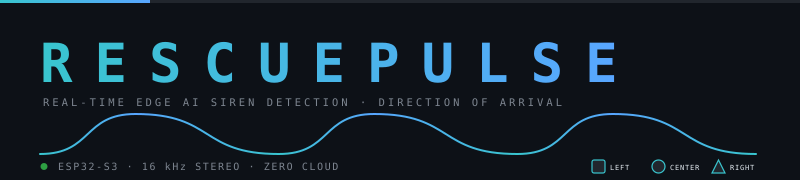


</div>

RescuePulse is an on-device edge-AI system on the ESP32-S3 that detects emergency vehicle sirens
(ambulances, fire engines, police) against heavy urban noise and estimates which way they are
approaching from — **LEFT**, **CENTER**, or **RIGHT** — before the vehicle is visually in range.
Detection drives a three-lane traffic light array that clears the siren lane and holds the others.

A dual INMP441 MEMS array feeds stereo I2S capture, ESP-DSP cross-correlation for direction, MFCC
feature extraction, and an INT8 TFLite Micro classifier. Everything runs on-chip, in real time, with
no cloud dependency.

---

## Key Capabilities and Performance Metrics

- **Real-Time Acoustic Classification:** Identifies emergency sirens against heavy urban noise (traffic, engines, horns, construction, speech).
- **Direction of Arrival (DoA) Estimation:** Uses dual-channel I2S capture and ESP-DSP cross-correlation (`dsps_corr_f32`) to localize siren source direction (Left / Right / Center) based on inter-microphone arrival time delay.
- **Strict Mathematical Parity:** C-based MFCC feature extraction achieves <1% L2 relative error compared to 64-bit Python Librosa references.
- **Full INT8 Quantization:** 108 KB quantized TensorFlow Lite for Microcontrollers model running without accuracy loss compared to the FP32 baseline.
- **Dual-Core FreeRTOS Pipeline:** Core 0 is dedicated to lossless stereo I2S DMA capture; Core 1 executes feature extraction, TDOA correlation, and TFLite inference.
- **Deterministic Memory Architecture:** Zero dynamic allocations (`malloc`) inside FreeRTOS task execution loops; uses static ping-pong buffers and Flash-mapped model data.
- **Noise and Silence Gating:** Dynamic AC RMS thresholding (`RMS_THRESHOLD 0.02`) prevents false triggers during quiet or ambient background intervals.
- **Debounced Majority Voting:** 4-window rolling majority vote with high confidence gating (≥ 3 of 4 windows at ≥ 75% confidence) eliminates transient false positives.

> **Where the time goes.** Compute per frame is small — MFCC ~3.3–3.4 ms plus ~15 ms of INT8
> inference. The end-to-end response is dominated by two deliberate design choices, not by compute:
> the 1.04 s acoustic context (`16640 / 16000`) and the consensus window, which needs three
> agreeing frames before it will fire. See [`LATENCY_ANALYSIS.md`](LATENCY_ANALYSIS.md) for the
> full breakdown and the optimisation options.

---

## System Architecture

![Animated three-lane architecture of the RescuePulse ESP32-S3 firmware: a stage rail across the top tracks MIC, I2S, DEINT, BUF, TDOA, MFCC, INT8, CNN and VOTE while a marker sweeps them. On core zero an audio capture task at priority five streams two INMP441 microphones into a 16 kilohertz I2S peripheral, de-interleaves the 32-bit slots, and fills a 133 kilobyte ping-pong buffer whose write head alternates every 1.04 seconds, with pulse rings on the capsules and scrolling traces. On core one an inference task at priority four meters AC RMS, gates on a 0.02 noise floor, estimates direction of arrival from a cross-correlation, extracts 13 MFCC coefficients, quantises to int8, runs a 108 kilobyte TFLite Micro network, and confirms a siren with a three-of-four majority vote. The verdict travels by queue to a traffic control task driving nine neon lamps and to a display task painting a 128 by 128 panel.](assets/architecture.svg)

*Dual-core execution path: capture on core 0, inference and traffic control on core 1. Nothing leaves the chip.*

<details>
<summary>Plain-text architecture diagram</summary>

```text
                                  ESP32-S3 System Pipeline
  ┌────────────────────────────────────────────────────────────────────────────────────────┐
  │                                                                                        │
  │  Mic 1 (Left)   ──┐                                                                    │
  │  (L/R -> GND)     │  I2S DMA (Core 0)      Ping-Pong Buffer       MFCC Extraction      │
  │                   ├────────────────────► [2][2][16640] Int16 ──► (512-pt FFT, 40 Mel,  │
  │  Mic 2 (Right)  ──┘  16 kHz Stereo         (133 KB static)        13 DCT Coeffs)       │
  │  (L/R -> 3.3V)                                                          │              │
  │                                                                         ▼              │
  │                      TDOA Cross-Correlation                      INT8 Quantization     │
  │                      dsps_corr_f32 (ESP-DSP)                            │              │
  │                                 │                                       ▼              │
  │                                 ▼                               TFLite Micro Model     │
  │                        Direction of Arrival                      (1D CNN Classifier)   │
  │                        [LEFT/RIGHT/CENTER]                              │              │
  │                                 │                                       ▼              │
  │                                 └───────────────┬───────────────────────┘              │
  │                                                 ▼                                      │
  │                                   4-Window Rolling Majority Vote (3 of 4)             │
  │                                                 │                                      │
  │                                                 ▼                                      │
  │                                   🚨 SIREN DETECTED [LEFT/RIGHT]                       │
  │                                                 │                                      │
  │                                                 ▼                                      │
  │                         🚦 PHASE 2: Emergency Vehicle Priority Control                 │
  │                            (Traffic Light State Machine)                               │
  │                                                                                        │
  │                          Lane GPIOs (1-6, 13-14, 21)                                   │
  │                          ┌─ LEFT:   RED(1) YELLOW(2) GREEN(3)                          │
  │                          ├─ CENTER: RED(4) YELLOW(5) GREEN(6)                          │
  │                          └─ RIGHT:  RED(13) YELLOW(14) GREEN(21)                       │
  │                                                                                        │
  │                          Dynamic Mode Selection:                                       │
  │                          • MODE_NORMAL:    Regular green→yellow→red cycling            │
  │                          • MODE_CLEARANCE: 2s all-red safety transition                │
  │                          • MODE_EMERGENCY: Priority green on siren lane                │
  │                                                                                        │
  └────────────────────────────────────────────────────────────────────────────────────────┘
```

</details>

---

## Live Demo

All photographs below are real captures from the running prototype. Images are cropped to a uniform
ratio and captioned by `scripts/make_gallery.py` so every row aligns at any viewport width.

### Direction of Arrival

<div align="center">
  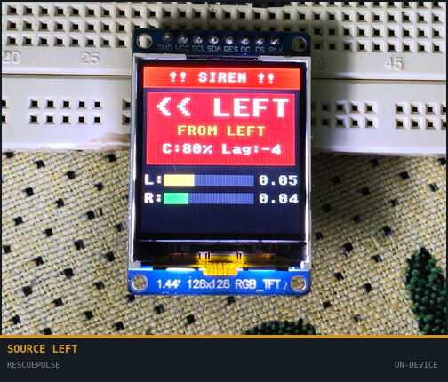
  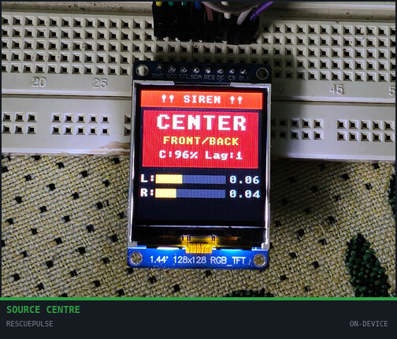
  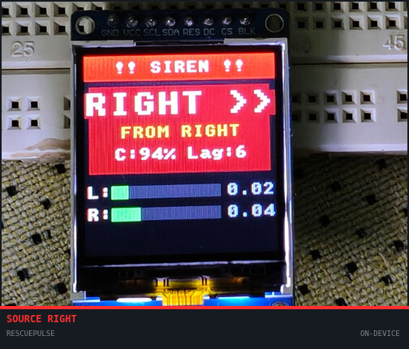
</div>

*Three live verdicts from a single siren, moved around the microphone pair. `Lag` is the TDOA
cross-correlation peak in samples; its sign and magnitude select the lane.*

### Traffic Light Response

<div align="center">
  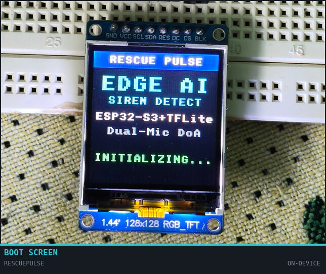
  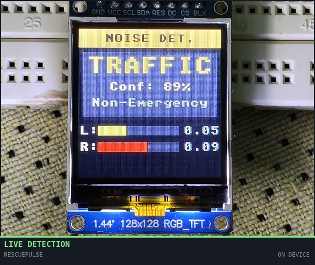
</div>

<div align="center">
  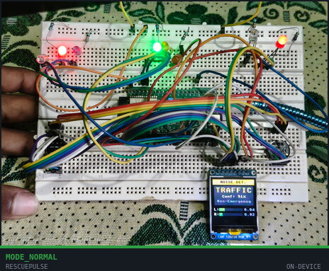
  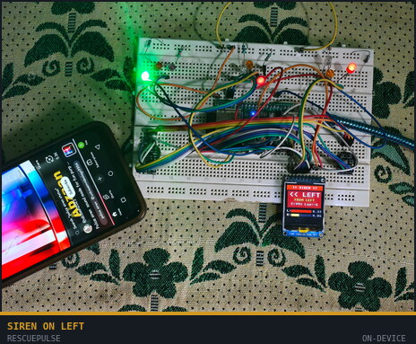
</div>

<div align="center">
  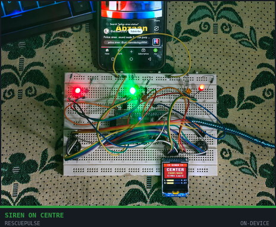
  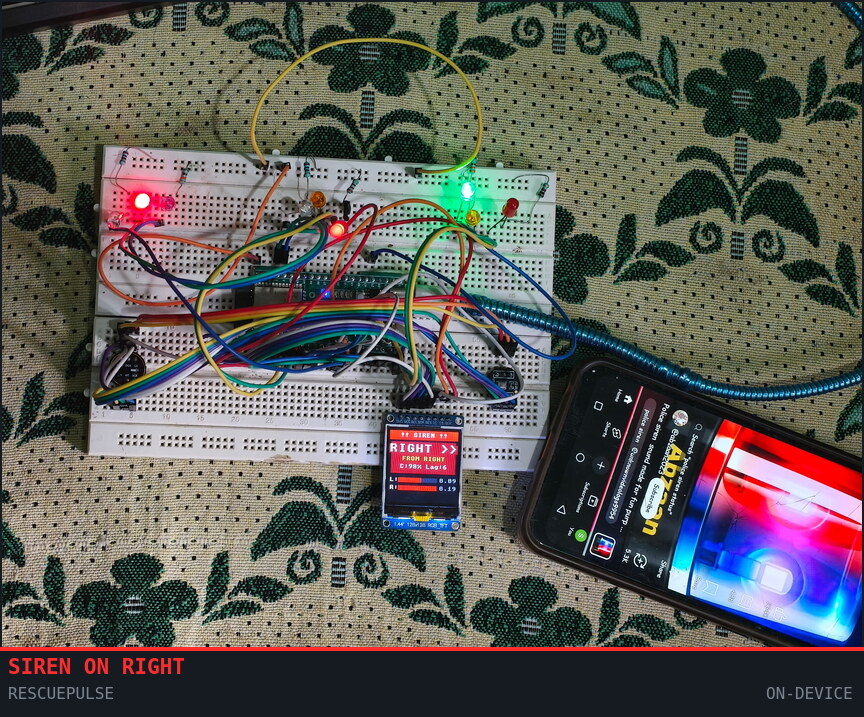
</div>

*Top: the controller at boot in `MODE_NORMAL`, then a live traffic-noise detection. The four bench
shots show the whole build — nine-lamp GPIO array, ST7735S panel and multimeter on the lamp rail —
responding to a siren presented on each lane in turn.*

### Model Training

<div align="center">
  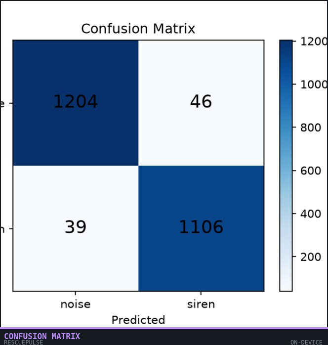
  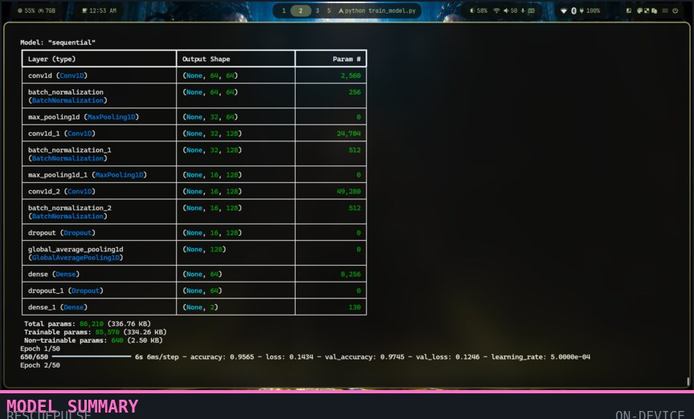
</div>

<div align="center">
  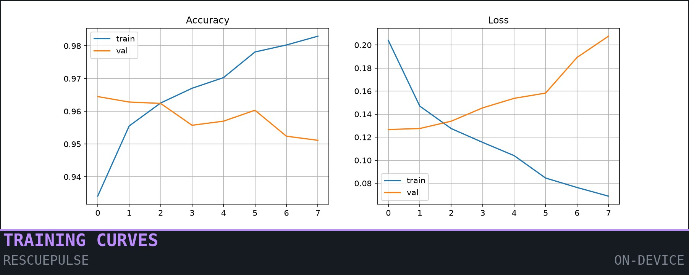
</div>

*The confusion matrix and the Keras `model.summary()` capture come from `scripts/train_model.py`; the
summary is the source of the tensor shapes in the CNN diagram below.*

Board reference: [`assets/ESP32-S3-WROOM-N16R8-Pinout.pdf`](assets/ESP32-S3-WROOM-N16R8-Pinout.pdf)
(one page, module pinout used to validate the GPIO assignments in this README).

---

## Hardware Configuration

### Bill of Materials

| Component | Specification | Function |
|---|---|---|
| **MCU** | ESP32-S3-WROOM-1-N16R8 (Edgehax N16R8 Pro) | Dual-core Xtensa LX7 @ 240 MHz, 16 MB Flash, 8 MB Octal PSRAM |
| **Microphone 1** | INMP441 I2S MEMS Microphone | Left acoustic sensor |
| **Microphone 2** | INMP441 I2S MEMS Microphone | Right acoustic sensor |
| **Display** | ST7735S 128×128 RGB SPI TFT | Verdict, direction and confidence readout |
| **Traffic array** | 9 GPIO-driven RGB LEDs | Three lanes × red / yellow / green |
| **Power** | 3.3V Regulated Power Rail | Low-noise analog/digital supply |

### Dual INMP441 Microphones (I2S Audio Bus)

| Signal | Mic 1 (Left Channel) | Mic 2 (Right Channel) | ESP32-S3 Pin | Function |
|---|---|---|---|---|
| **VDD** | 3.3V | 3.3V | 3.3V | Power supply |
| **GND** | GND | GND | GND | Common ground |
| **SCK / BCLK** | SCK | SCK | **GPIO 15** | Bit Clock (shared) |
| **WS / LRCLK** | WS | WS | **GPIO 16** | Word Select (shared) |
| **SD / DOUT** | SD | SD | **GPIO 17** | Serial Data (shared single DIN) |
| **L/R** | **Tied to GND** | **Tied to 3.3V** | — | Hardware slot selection |

*How shared SD works:* During standard Philips I2S transmission, Mic 1 drives the data bus during the Left slot (WS LOW) and tri-states its output driver during the Right slot (WS HIGH), while Mic 2 drives during the Right slot and tri-states during the Left slot.

### ST7735S SPI TFT Display (128×128 RGB)

| ST7735S Pin | ESP32-S3 GPIO | Function |
|---|---|---|
| **SCL / SCLK** | **GPIO 12** | SPI Clock |
| **SDA / MOSI** | **GPIO 11** | SPI Master Out / Data |
| **DC / RS** | **GPIO 10** | Data / Command Select |
| **CS** | **GPIO 9** | Chip Select (or GND if none) |
| **RST / RES** | **GPIO 8** | Hardware Reset |
| **BLK / LED** | **GPIO 7** | Backlight (3.3V) |
| **VCC** | **3.3V** | Power supply |
| **GND** | **GND** | Ground |

---

## Signal Processing & Direction of Arrival (DoA)

### 1. Dual-Channel Capture & De-interleaving
The I2S peripheral captures 32-bit interleaved stereo slots at 16,000 Hz. The capture driver unpacks the DMA scratch buffer:
- Left Channel (Mic 1): Even slot index, arithmetic right-shifted `>> 16`.
- Right Channel (Mic 2): Odd slot index, arithmetic right-shifted `>> 16`.

### 2. Time Difference of Arrival (TDOA)

![Animated direction-of-arrival explainer in three neon zones: a top-down scene of two microphones and a siren source, a sixty-five bin cross-correlation histogram with a highlighted plus-or-minus-two dead zone, and a verdict card. On a twelve second loop the wavefronts arrive from the left, then head on, then from the right; the correlation peak snaps to bin 28, bin 31 and then bin 37; the wavefront rings pulse outward; and the verdict chip steps through amber source left, green source centre and red source right.](assets/tdoa-doa.svg)

Sound propagation delay $\Delta t$ between the two microphones separated by distance $d$ is estimated by computing normalized cross-correlation:

$$R_{LR}(\tau) = \sum_{n} x_L[n + \tau] \cdot x_R[n]$$

Using the hardware-accelerated `dsps_corr_f32` routine from ESP-DSP:
- **$\tau < -\text{threshold}$:** Left microphone received the wavefront first $\rightarrow$ **Source on LEFT**.
- **$\tau > +\text{threshold}$:** Right microphone received the wavefront first $\rightarrow$ **Source on RIGHT**.
- **$|\tau| \le \text{threshold}$:** Frontal / equidistant arrival $\rightarrow$ **Source in CENTER**.

Cross-correlation vectors are averaged across multiple windows to ensure stability in resonant environments.

### 3. Acoustic Feature Extraction (MFCC)
Inference is executed on the channel with higher RMS volume:
1. **Pre-emphasis:** $y[n] = x[n] - 0.97 \cdot x[n-1]$.
2. **Hamming Window & STFT:** 512-point real FFT with 256-sample hop size over 64 frames ($\sim 1.04\text{ s}$).
3. **Mel Filterbank:** 40 triangular filters spanning 20 Hz to 8000 Hz.
4. **Log Power Spectrum:** Logarithmic scaling with $-80\text{ dB}$ floor.
5. **Discrete Cosine Transform (DCT-II):** Orthogonal projection to 13 MFCC coefficients.

---

## Neural Network & Quantization

### Model Architecture (1D CNN)

![Animated feature pipeline and network: six neon cards take raw PCM through pre-emphasis, framing into sixty-four windows, a short-time Fourier transform, a forty filter mel bank with log power and a discrete cosine transform, and int8 quantisation. Below, an activation sweeps left to right through a one-dimensional convolutional network, lighting each layer as it passes: the sixty-four by thirteen input spectrogram, the sixty-four and one hundred and twenty eight filter banks, global average pooling collapsing the time axis, the dense node grid and the two output nodes. The NOISE and SIREN output bars then step through confidences logged from the real device.](assets/mfcc-cnn.svg)

<details>
<summary>Plain-text model architecture</summary>

```text
Input: (64, 13) MFCC Spectrogram
  │
  ├──► Conv1D (64 filters, kernel=3, padding='same')  -> (64, 64)   + BatchNorm + ReLU + MaxPool(2)  -> (32, 64)
  ├──► Conv1D (128 filters, kernel=3, padding='same') -> (32, 128) + BatchNorm + ReLU + MaxPool(2)  -> (16, 128)
  ├──► Conv1D (128 filters, kernel=3, padding='same') -> (16, 128) + BatchNorm + ReLU + Dropout(0.3)
  ├──► GlobalAveragePooling1D                                        -> (128,)
  ├──► Dense (64 units) + ReLU + Dropout(0.3)                        -> (64,)
  └──► Dense (2 units, Softmax) -> [Noise, Siren]                   -> (2,)
```

*Shapes are `(time_steps, features)`, matching the Keras `model.summary()` capture in the
[Model Training](#model-training) gallery.*

</details>

### Quantization & Memory Budget
- **Model Type:** TensorFlow Lite INT8 (Full Integer Post-Training Quantization).
- **Model Flash Size:** 108,392 bytes, linked as a read-only `const` array in `model_data.cc` and mapped from flash.
- **RAM Footprint:**
  - `s_audio_buf` (Ping-Pong Stereo): 133,120 bytes.
  - TDOA / MFCC Static Buffers: ~86 KB (`s_y` 66,560 · `s_db` 10,240 · `s_fft` 4,096 · `s_power` 1,028 · `s_mel` 160).
  - ST7735S framebuffer: 32,768 bytes. I2S staging scratch: 4,096 bytes.
  - FreeRTOS stacks: 32,256 bytes total across the four tasks and the main task.
  - TFLite Tensor Arena: 204,800 bytes allocated in external Octal PSRAM (8 MB total) — the **only** dynamic allocation in the audio path.

> **Note on the earlier "76.4% DRAM" figure.** That number was carried over from an earlier revision and
> does not match the current source. The breakdown above is derived directly from the `static`
> allocations in `src/`. For the authoritative figure on your own build, run `pio run -t size`
> and read the `.bss`/`.data` totals from the map output.

---

## Phase 2: Emergency Vehicle Priority Traffic Light Control

The traffic controller is tightly integrated with the detection pipeline: `inference_task` (Core 1)
publishes `detection_msg_t` messages on a FreeRTOS queue, and `traffic_ctrl_task` (Core 1, lower
priority) consumes them to drive the GPIO array. Because inference runs at priority 4 and traffic
control at 3, the siren verdict is always available before traffic state is updated.

### Operating Modes

| Mode | Behaviour |
|------|-----------|
| **MODE_NORMAL** | Standard cycling: LEFT → CENTER → RIGHT → LEFT. Each lane runs GREEN (8s) → YELLOW (2s) → RED, with no external input. |
| **MODE_CLEARANCE** | All lanes RED for 2s. Entered when a siren arrives on a different lane or during a yellow phase, so the intersection is clear before priority begins. |
| **MODE_EMERGENCY** | The siren lane holds continuous GREEN and all other lanes are held RED. Green extends indefinitely while the siren persists, and the mode expires after 10s without a detection. |

**Smart clearance avoidance:** if a siren is detected on a lane that is already GREEN in NORMAL mode
and not in its yellow phase, the controller transitions straight to EMERGENCY without the 2s
clearance delay. **Message processing:** the controller polls for detections every 100 ms, keeping
state transitions responsive while remaining predictable for non-emergency traffic. **Timeout safety:**
EMERGENCY expires after 10s without a detection, so the system returns to normal operation even if
messages stop unexpectedly.

### State Machine Transitions


<details>
<summary>Plain-text state machine diagram</summary>

```
┌──────────────┐
│ MODE_NORMAL  │◄─────────────────────────────┐
│ (Cycling)    │                              │
└──────┬───────┘                              │
       │                                      │
       │ Siren detected on different lane     │ No siren for
       │ or during yellow phase               │ 10+ seconds
       │                                      │
       ▼                                      │
┌──────────────┐                              │
│MODE_CLEARANCE│                              │
│ (2s all RED) │                              │
└──────┬───────┘                              │
       │                                      │
       │ After 2 seconds                      │
       │                                      │
       ▼                                      │
┌──────────────────┐                          │
│ MODE_EMERGENCY   │──────────────────────────┘
│ (Siren lane      │
│  GREEN, all else │
│  RED)            │
└──────────────────┘
```

</details>

### Detection Message Flow

```c
typedef struct {
    bool  siren_active;   /* true if siren detected */
    lane_t direction;     /* LANE_CENTER, LANE_LEFT, or LANE_RIGHT */
    float confidence;     /* Classification confidence (0.0 - 1.0) */
} detection_msg_t;
```

The traffic controller processes these messages to:
- Update emergency lane information
- Refresh the "last siren detected" timestamp
- Optimize state transitions to minimize clearance delays when the emergency vehicle is already on a GREEN lane

### Lane GPIO Pin Mapping

Nine GPIO pins control the 3-lane traffic light array (RGB LEDs):

| Lane | Red | Yellow | Green |
|------|-----|--------|-------|
| **LEFT** | GPIO 1 | GPIO 2 | GPIO 3 |
| **CENTER** | GPIO 4 | GPIO 5 | GPIO 6 |
| **RIGHT** | GPIO 13 | GPIO 14 | GPIO 21 |

All pins are configured as digital outputs with no pull resistors. Drive strength is suitable for direct LED control with current-limiting resistors on the hardware side.

---

## Live Hardware Execution Logs

A serial capture from an ESP32-S3 running live dual-microphone inference in real time:

> **Stale capture — read it for the values, not the timing.** This log predates the current
> firmware and is spliced from more than one session:
> - `[n/5]` counters, but `src/main.c:34` now sets `VOTE_WINDOWS 4` / `VOTE_THRESH 3`, so a
>   current build logs `[n/4]`.
> - The ~5.2 s line spacing does **not** match the 1.04 s frame time (`N_SAMPLES 16640` at
>   16 kHz) and is not explained by the window change.
> - The counter jumps from `[0/5]` back to `[3/5]` mid-capture, confirming the splice.
>
> The `Conf`, `RMS` and `Lag` figures are genuine device readings and remain the source of the
> values used in the diagrams above. Re-capture on your hardware to replace this section.

```text
I (1410146) rescuepulse: 🔇 Background Noise [0/5] (Conf: 0.91) [RMS L:0.028 R:0.031]
W (1415336) rescuepulse: 🚨 SIREN DETECTED [LEFT] (Conf: 0.99) [3/5] [RMS L:0.087 R:0.043, Lag: -4, MaxPCM: 9100]
W (1420546) rescuepulse: 🚨 SIREN DETECTED [LEFT] (Conf: 0.88) [4/5] [RMS L:0.082 R:0.047, Lag: -4, MaxPCM: 8092]
W (1425746) rescuepulse: 🚨 SIREN DETECTED [RIGHT] (Conf: 1.00) [5/5] [RMS L:0.091 R:0.165, Lag: 5, MaxPCM: 15097]
W (1430936) rescuepulse: 🚨 SIREN DETECTED [RIGHT] (Conf: 0.98) [5/5] [RMS L:0.066 R:0.090, Lag: 5, MaxPCM: 9646]
W (1436146) rescuepulse: 🚨 SIREN DETECTED [CENTER] (Conf: 0.97) [5/5] [RMS L:0.083 R:0.060, Lag: -1, MaxPCM: 11096]
W (1441346) rescuepulse: 🚨 SIREN DETECTED [CENTER] (Conf: 0.98) [5/5] [RMS L:0.094 R:0.064, Lag: -1, MaxPCM: 10679]
W (1446536) rescuepulse: 🚨 SIREN DETECTED [CENTER] (Conf: 0.84) [5/5] [RMS L:0.041 R:0.042, Lag: 0, MaxPCM: 6456]
I (1451746) rescuepulse: 🔇 Background Noise [1/5] (Conf: 0.93) [RMS L:0.037 R:0.040]
```

---

## Repository Structure

```
RescuePulse/
├── Rescue_Pulse_PIO/            # PlatformIO ESP32-S3 Firmware Project
│   ├── src/
│   │   ├── main.c               # Core orchestration, TDOA DoA, RMS metering, voting
│   │   ├── i2s_capture.c/.h     # 16kHz 32-bit stereo I2S DMA driver
│   │   ├── mfcc.c/.h            # ESP-DSP accelerated MFCC extraction
│   │   ├── inference.cpp/.h     # TFLite Micro C++ bridge & tensor arena management
│   │   ├── display_st7735s.c/.h # 128x128 RGB SPI TFT driver
│   │   ├── traffic_ctrl.c/.h    # NORMAL / CLEARANCE / EMERGENCY lane state machine
│   │   ├── model_data.cc        # Flash-mapped INT8 TFLite model binary
│   │   ├── model_config.h       # Standardization & affine quantization constants
│   │   ├── mel_tables.h         # Precomputed filterbank & DCT tables
│   │   └── test_vectors.h       # Pre-computed validation test vectors
│   ├── platformio.ini           # Build flags, board config, and dependencies
│   └── partitions_16MB.csv      # 16 MB flash partition configuration
│
├── datasets/                    # Audio datasets & metadata manifests
├── models/                      # Trained Keras models & quantization artifacts
├── scripts/                     # Python ML training, validation & media pipeline
│   ├── audit_dataset.py         # Audio dataset validation and deduplication
│   ├── process_raw_data.py      # Resampling and audio normalization
│   ├── extract_features.py      # Batch MFCC extraction with SpecAugment
│   ├── train_model.py           # Keras 1D CNN training with clip-level voting
│   ├── quantize_model.py        # Post-training int8 TFLite quantization
│   ├── gen_mfcc_test_vectors.py # C header generation for mathematical parity tests
│   ├── make_gallery.py          # Crop/frame/title the README photo gallery
│   ├── preview_svgs.py          # Render & statically validate the animated SVGs
│   └── create_gifs.py           # Build documentation GIFs from capture frames
└── assets/                      # Schematics, animated SVGs, logs, and photos
    ├── gallery/                 # Generated, uniformly cropped README cards
    ├── *.svg                    # Animated banner, architecture, DoA, CNN, FSM
    └── ESP32-S3-WROOM-N16R8-Pinout.pdf
```

---

## Build and Deployment

### Prerequisites
- [PlatformIO Core (CLI)](https://docs.platformio.org/en/latest/core/index.html) or VS Code PlatformIO IDE
- USB-C cable connected to ESP32-S3 USB/JTAG port

### Compilation and Flashing

```bash
# Navigate to the firmware workspace
cd Rescue_Pulse_PIO

# Clean and compile firmware
pio run -t clean && pio run

# Flash to the connected ESP32-S3
pio run -t upload

# Open the serial monitor at 115200 baud
pio device monitor -b 115200
```

### Offline Mathematical Parity Verification
To run the automated test harness validating C MFCC output against Python reference vectors:

```bash
# Build with RP_PARITY_TEST enabled (already configured in platformio.ini)
pio run -t upload -e edgehax_esp32s3_pro
```

When booted, the serial console outputs:
```text
I (xxx) rescuepulse: Siren Test: L2 Error = 0.00341 (PASS) [3.4 ms]
I (xxx) rescuepulse: Siren Inference: Predicted 1 (Expected 1) - PASS [scores 0.0118 / 0.9882]
I (xxx) rescuepulse: Noise Test: L2 Error = 0.00412 (PASS) [3.3 ms]
I (xxx) rescuepulse: Noise Inference: Predicted 0 (Expected 0) - PASS [scores 0.9921 / 0.0079]
```

---

## License

This project is licensed under the Apache 2.0 License. See [`LICENSE`](LICENSE).
